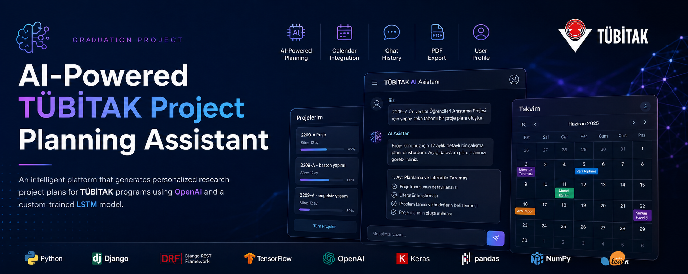
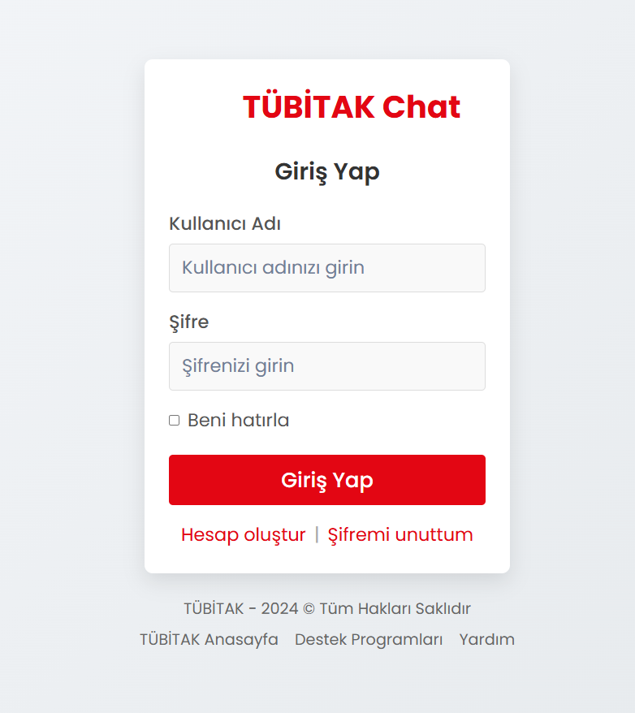
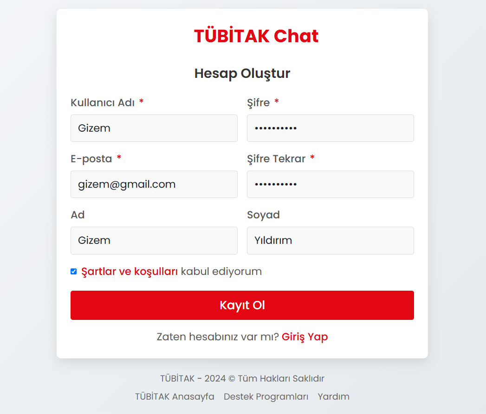
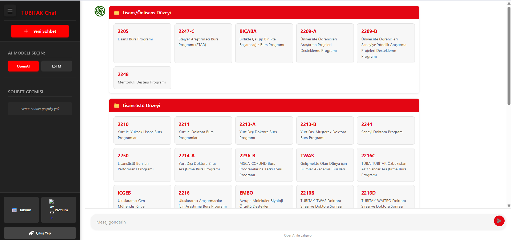
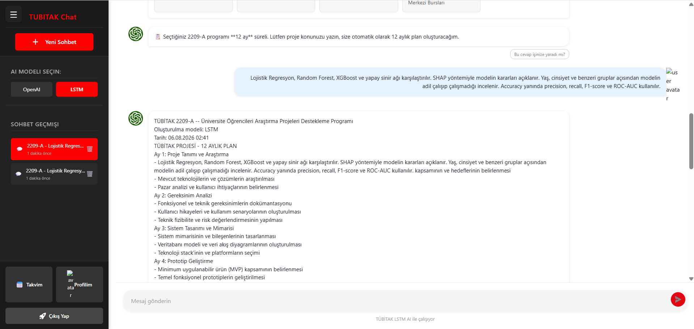
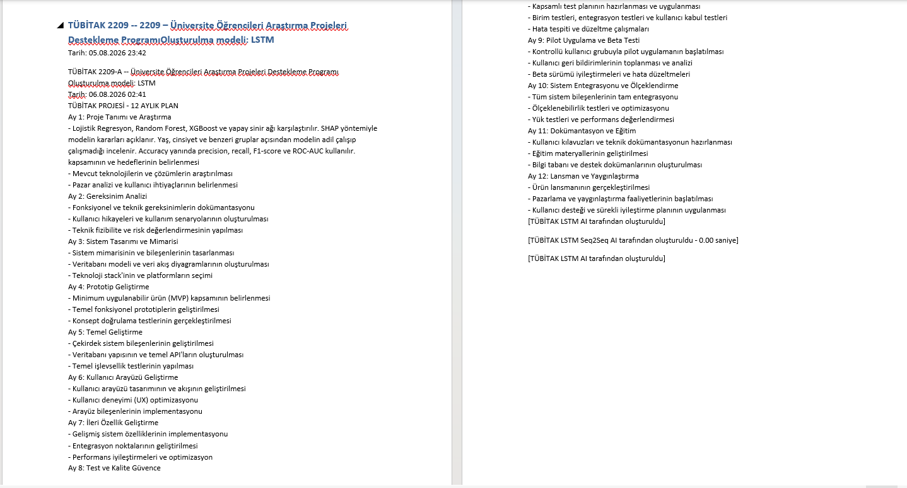
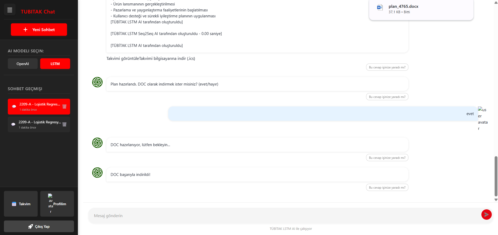
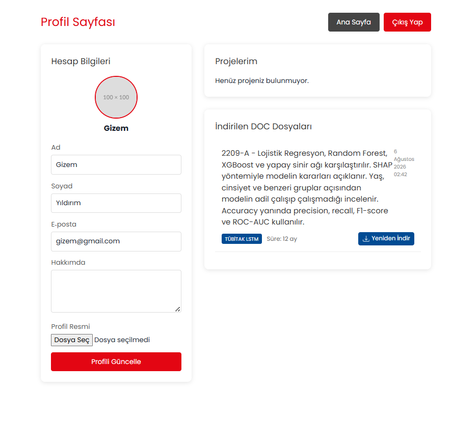

# AI-Powered TÜBİTAK Project Planning Assistant

<p align="center">
  
</p>

<p align="center">
  <strong>Computer Engineering Graduation Project</strong><br>
  Artificial Intelligence • Django • LSTM • OpenAI • Project Planning • NLP
</p>

---

# Executive Summary

The **AI-Powered TÜBİTAK Project Planning Assistant** is a web-based intelligent planning platform developed as my Computer Engineering graduation project.

The system assists researchers and university students in planning research projects for various TÜBİTAK funding programs. Based on the selected funding program, project topic, and official project duration, the platform automatically generates personalized monthly research plans.

To provide flexibility and compare different artificial intelligence approaches, the system supports two independent planning engines:

- **OpenAI-based Project Planning**
- **Custom-trained LSTM-based Project Planning**

The generated plans can be viewed through an interactive chat interface, managed within a personal calendar, exported as PDF documents, and stored inside the user's profile for future reference.

---

# Project Motivation

Preparing research projects for TÜBİTAK programs is a complex process that requires careful planning over several months.

Researchers often face challenges such as:

- Defining realistic project milestones
- Organizing long-term research activities
- Managing project schedules
- Tracking completed tasks
- Preparing structured project roadmaps

This project aims to simplify this process by combining artificial intelligence with automated project planning.

---

# Project Objectives

The primary objectives of this project are:

- Generate personalized project plans using Artificial Intelligence.
- Support multiple TÜBİTAK funding programs.
- Automatically create monthly research schedules.
- Allow users to choose between different AI models.
- Store previous project plans.
- Provide calendar-based task visualization.
- Export generated plans as PDF documents.
- Create a reusable intelligent planning platform for future research projects.

---

# Key Features

- User Registration
- User Authentication
- AI-powered Project Planning
- OpenAI Integration
- Custom-trained LSTM Model
- AI Model Selection
- Personalized Monthly Project Plans
- TÜBİTAK Program Selection
- Interactive AI Chat
- Chat History
- Calendar Integration
- User Profile Management
- Project History
- PDF Report Generation

---

# System Workflow

```text
User Login
      │
      ▼
Select TÜBİTAK Program
      │
      ▼
Enter Project Topic
      │
      ▼
Choose AI Model
(OpenAI / LSTM)
      │
      ▼
Generate Project Plan
      │
      ▼
Monthly Schedule
      │
      ▼
Calendar Integration
      │
      ▼
Save Project
      │
      ▼
PDF Export
```

---

# Artificial Intelligence Models

## OpenAI Planning Engine

The OpenAI model generates intelligent project plans by analyzing:

- Selected TÜBİTAK funding program
- Project topic
- Program duration

The generated roadmap is adapted to the official duration of the selected funding program.

---

## Custom LSTM Planning Engine

One of the main contributions of this project is the development of a custom LSTM-based sequence generation model.

Instead of relying exclusively on external AI services, a dedicated LSTM model was trained using project-planning datasets prepared during the development process.

The trained model was integrated into the Django application and can independently generate structured project plans based on user inputs.

This enables the platform to provide AI-generated planning even without relying solely on cloud-based language models.

---

# Project Architecture

```text
                        User
                          │
                          ▼
                 Django Web Application
                          │
          ┌───────────────┴───────────────┐
          │                               │
          ▼                               ▼
    OpenAI API                 Custom LSTM Model
          │                               │
          └───────────────┬───────────────┘
                          ▼
               AI Planning Engine
                          ▼
                 Calendar Generator
                          ▼
                  PDF Report Generator
                          ▼
                  SQLite Database
```

---

# Technologies Used

| Category | Technology |
|-----------|------------|
| Programming Language | Python |
| Backend | Django |
| API | Django REST Framework |
| Artificial Intelligence | TensorFlow |
| Deep Learning | LSTM |
| Natural Language Processing | NLTK |
| Machine Learning | Scikit-Learn |
| Data Processing | Pandas |
| Numerical Computing | NumPy |
| Visualization | Matplotlib |
| AI Service | OpenAI API |
| Database | SQLite |
| Report Generation | ReportLab |
| Spreadsheet Processing | OpenPyXL |
| Frontend | HTML • CSS • JavaScript |

---

# Dataset

The project includes custom datasets prepared specifically for project planning.

Datasets include:

- Project planning examples
- Question-answer pairs
- Extended planning datasets

The datasets were preprocessed before model training and used for LSTM sequence generation.

---

# Model Training

The project contains multiple AI training pipelines developed during experimentation.

Implemented approaches include:

- LSTM Sequence Generation
- Seq2Seq LSTM
- T5 Transformer Experiments

The training process includes:

- Dataset preprocessing
- Tokenization
- Sequence generation
- Model checkpoint creation
- Training logs
- Model evaluation
- Django integration

The custom LSTM model was successfully integrated into the application and is capable of generating project planning outputs.

---

# Main Modules

- User Management
- Authentication
- AI Planning Engine
- OpenAI Integration
- LSTM Model
- Calendar Management
- Project Repository
- Chat History
- PDF Generator
- User Profiles

---

# Hardware & Software

Although the platform primarily focuses on Artificial Intelligence and Web Technologies, the project demonstrates the integration of:

- AI-powered planning
- Machine Learning
- Natural Language Processing
- Full Stack Development
- Database Management
- Document Generation

within a single software platform.

---

# Results

The developed platform successfully generates personalized research project plans based on:

- Selected TÜBİTAK funding program
- Project topic
- Official project duration
- Selected AI model

Users can compare planning outputs generated by both the OpenAI model and the custom-trained LSTM model within the same application.

The generated plans can be:

- Saved
- Reviewed later
- Exported as PDF
- Displayed in the integrated calendar
- Accessed through the user's profile

---

# Skills Demonstrated

- Artificial Intelligence
- Machine Learning
- Deep Learning
- LSTM Networks
- Natural Language Processing
- Django Development
- REST API Development
- Python
- TensorFlow
- Software Architecture
- Database Design
- User Authentication
- Full Stack Development
- Prompt Engineering
- AI Integration

---

# Future Improvements

Possible future enhancements include:

- Transformer-based planning models
- Retrieval-Augmented Generation (RAG)
- Multi-language support
- Cloud deployment
- Mobile application
- Team collaboration features
- Reinforcement learning for adaptive planning

---

# Repository Structure

```text
ai-powered-tubitak-project-planner/

│
├── agent_ai/
├── agent_ai2/
├── agent_memory/
├── chat/
├── project_planning/
├── users/
├── templates/
├── media/
├── model_checkpoints/
├── nltk_data/
├── manage.py
├── requirements.txt
├── db.sqlite3
└── README.md
```

---

# Project Status

**Status:** Completed

The current version includes:

- Functional Django backend
- User authentication
- OpenAI integration
- Custom-trained LSTM model
- AI model selection
- Calendar integration
- Project history
- Chat history
- PDF generation
- SQLite database

The LSTM model has been successfully trained, integrated, and tested within the application.

---

# 📸 Application Screenshots

## 🔐 Login Page

Secure login interface for registered users.

<p align="center">
  
</p>

---

## 📝 Registration Page

New users can create an account before accessing the AI assistant.

<p align="center">
  
</p>

---

## 🏠 Main Dashboard

The dashboard allows users to:

- Select a TÜBİTAK funding program
- Choose between OpenAI and the custom-trained LSTM model
- Start a new AI conversation
- Access previous conversations
- Navigate to Calendar and Profile pages

<p align="center">
  
</p>

---

## 🤖 LSTM AI Project Planning

The custom-trained LSTM model generates a complete project roadmap based on:

- Selected TÜBİTAK program
- Project duration
- User's research topic

<p align="center">
  
</p>

---

## 📄 Generated Project Plan

The AI automatically creates a detailed month-by-month project plan.

<p align="center">
  
</p>

---

## 📑 DOC Report Generation

Users can export the generated project plan as a Microsoft Word document.

<p align="center">
  
</p>

---

## 📅 Calendar Integration

The generated milestones are automatically transferred to an interactive calendar.

<p align="center">
  
</p>

---

## 👤 User Profile

Users can:

- Update profile information
- Manage personal details
- Access previously generated project reports
- Re-download generated documents

<p align="center">
  
</p>

# Disclaimer

This repository has been prepared for educational and portfolio purposes.

Sensitive information including API keys, configuration files, credentials, and private settings has been removed before publication.

The project demonstrates the architecture, implementation, and integration of an AI-powered research planning platform while preserving security and confidentiality.
